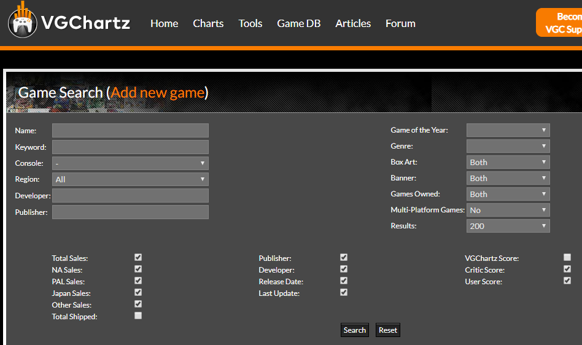

vgchartzfull is a python script based on BeautifulSoup. It creates a dataset based on data from http://www.vgchartz.com/gamedb/.
Search Criteria:


The dataset is saved as vgsales.csv.

You will need to have BeautifulSoup, numpy, and pandas added.
They can be installed by pip in the Command Prompt/Terminal.

```
C:\Users\Prithvi Kinariwala>py -m pip install beautifulsoup4
C:\Users\Prithvi Kinariwala>py -m pip install numpy
C:\Users\Prithvi Kinariwala>py -m pip install pandas
```

Thanks to Chris Albon.
http://chrisalbon.com/python/beautiful_soup_scrape_table.html
